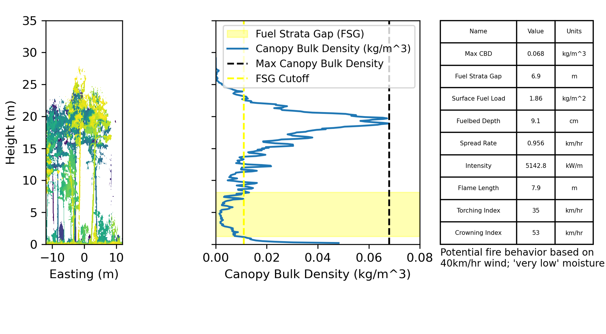

## voxelmon
This package produces voxelized leaf area density metrics from lidar which can be used to produce vegetation metrics for wildfire risk modeling, 
treatment effect monitoring, hydrology analysis, wildlife habitat suitability, and more. Currently the package is compatible with single- and multiple- scan data from the Leica BLK 360 as well as ALS and UAV lidar.

## Installation
If you are unfamiliar with Python, follow this [user guide](https://docs.google.com/document/d/1OuOK_Xj9kzQYp_oARr-3C10PqYRyHlgRpw89BaMAPE4/edit?usp=sharing)

If you are familiar with Python:

`cd [install_directory]`

`git clone https://github.com/j-tenny/voxelmon.git`

`conda create -n [env_name]`

`pip install [install_directory]`

Or `pip install git+https://github.com/j-tenny/voxelmon.git`

## Usage
If you are unfamiliar with Python, follow this [user guide](https://docs.google.com/document/d/1OuOK_Xj9kzQYp_oARr-3C10PqYRyHlgRpw89BaMAPE4/edit?usp=sharing).

If you are familiar with Python, look through the example_scripts folder (the folder contains its own readme). Look at 
[example_scripts/process_predict_ptx.py](https://github.com/j-tenny/voxelmon/blob/master/example_scripts/process_predict_ptx_dir.py)
and the [user guide](https://docs.google.com/document/d/1OuOK_Xj9kzQYp_oARr-3C10PqYRyHlgRpw89BaMAPE4/edit?usp=sharing) to process TLS files (in .ptx format), estimate canopy fuel metrics, and predict fire behavior.



As a simpler example, the code below will process a single TLS scan in .ptx format and create files within the export 
folder including a 3D grid with leaf area density estimates, a vertical profile of leaf area density, and plot summary 
metrics. The 3D grid and DEM files are formatted as a table with a row for each grid cell and columns for x, y, z 
coordinates and variables that describe each cell. This allows the files to be opened in CloudCompare. Note, if you open
PAD grid file in CloudCompare, you will need to filter on PAD > 0 and/or CLASSIFICATION > -2.

```
import voxelmon
ptx_file = 'Data/scan1.ptx'
export_dir = 'Data/'
ptx = voxelmon.TLS_PTX(ptx_file, apply_translation=True, apply_rotation=True, drop_null=False)
grid, profile, plot_summary = ptx.execute_default_processing(export_dir=export_dir, plot_name='scan1', cell_size=0.1,
                                                             plot_radius=11.3, max_height=50, max_occlusion=0.8,
                                                             sigma1=0, min_pad_foliage=.01, max_pad_foliage=6)
# This opens an interactive 3D viewer
grid.visualize_3d()
```


To process all .ptx files in a directory, see [example_scripts/process_single_ptx_dir.py](https://github.com/j-tenny/voxelmon/blob/master/example_scripts/process_single_ptx_dir.py).
For multiple-scan mode, the process is similar. Replace `voxelmon.TLS_PTX()` with `voxelmon.TLS_PTX_Group()` and replace
`ptx_file` with a list of filepaths to ptx files that are part of this scan group. Scans must be registered with transforms
provided by either the .ptx header or .mat.txt files located in the same directory with file names matching their 
associated scans.

## Standard Output Descriptions:

### Grid (export_folder/PAD_Grid) 
A table that contains a row for each 3D grid cell (ie voxel)

**Columns:**
- X: x coordinate for center of voxel
- Y: y coordinate for center of voxel
- Z: z coordinate for center of voxel
- HAG: height above ground for center of voxel, meters
- P_DIRECTED: total count of pulses directed towards this voxel (includes pulses that were intercepted before arrival)
- P_TRANSMITTED: count of pulses that were transmitted *through* this voxel
- P_INTERCEPTED: count of pulses that were intercepted *within* this voxel
- OCCLUSION: ratio of pulses intercepted *before* reaching this voxel `OCCLUSION = 1-(P_TRANSMITTED+P_INTERCEPTED)/P_DIRECTED`
- PAD: plant (leaf) area density, m^2/m^3. `PAD = -np.log(1 - (P_INTERCEPTED / (P_INTERCEPTED + P_TRANSMITTED))) / (G * MEAN_PATH_LENGTH)`
- CLASSIFICATION: value describing voxel classification according to `Grid.classification_key`

**Notes:**
- Input grid coordinates are assumed to be in meters. Otherwise, units will differ.
- Grid coordinates are calculated after applying transforms to the PTX file.
- G is assumed to be 0.5 and MEAN_PATH_LENGTH is assumed to be `0.843 * CELL_SIZE`, following [Grau et al 2017](https://doi.org/10.1016/j.rse.2017.01.032).
- Using the default processing and classification algorithms, the classification is based on thresholds of occlusion and PAD. 
  - If occlusion > max_occlusion (default=0.8), class = -1 (occluded/null)
  - If PAD < 0, class = -1 (occluded/null)
  - If PAD >= min_pad_foliage (default=.01), class = 3 (foliage)
  - If PAD > max_pad_foliage (default=6.), class = 5 (non-foliage)
  - Otherwise, class = -2 (empty)

### Profile (export_folder/PAD_Profile)
A table that contains a row for each height bin. Voxels are clipped to plot_radius, then summarized by height-above-ground.

**Columns:**
- PLT_CN: plot ID, taken from the filename of the scan in most processing scripts
- HT: height above ground, meters
- HEIGHT_BIN: unitless integer representing height above ground, used for table joins
- FOLIAGE: proportion of non-occluded voxels classified as foliage
- NONFOLIAGE: proportion of non-occluded voxels classified as non-foliage
- EMPTY: proportion of non-occluded voxels classified as empty
- OCCLUDED: proportion of voxels classified as occluded/null
- PAD: mean plant area density (m^2/m^3) for non-occluded voxels in this height bin
- *CBD: canopy bulk density (kg/m^3)

**Notes:**
- These columns represent the expected result following default classification and processing algorithms. For advanced use, see `Grid.summarize_by_height()`.
- Height above ground is estimated for the center of each voxel cell, then voxels are assigned to height bins using integer (floor) division: `HEIGHT_BIN = HAG // CELL_SIZE`.
- CBD is not estimated by default, but scripts such as `example_scripts/process_predict_ptx_dir.py` append CBD predictions to this table.

### Plot Summary (export_folder/Plot_Summary)
A table that contains a row for each plot ID (each file). Data are clipped to plot_radius, then summarized.

**Columns:**
- TERRAIN_SLOPE: mean terrain slope in degrees
- TERRAIN_ASPECT: mean terrain aspect in degrees relative to the y coordinate axis (relative to north if y-axis has been aligned to north).
- TERRAIN_ROUGHNESS: RMSE of elevation deviations from the de-trended DEM (meters).
- TERRAIN_CONCAVITY: Sum of elevation devations within half of the plot radius minus sum of elevation deviations beyond half of the plot radius (meters).
- CANOPY_COVER: Proportion of non-occluded plot area where canopy height > cutoff_height (default=2 meters), calculated via raster approach (see `Grid.calculate_canopy_cover`)
- PLT_CN: plot ID, taken from the filename of the scan in most processing scripts

Scripts to recreate the analysis from the publication [Canopy and surface fuels measurement using 
terrestrial lidar single-scan approach in the Mogollon highlands of Arizona](https://www.publish.csiro.au/wf/Fulltext/WF24221) 
are located in the branch final_analysis_tenny_et_al_2025. The
master branch will be updated with newer algorithms and pipelines for additional data sources.

## Contact

Contact jt893@nau.edu with any questions. 

## Citation

Tenny Johnathan T., Sankey Temuulen Tsagaan, Munson Seth M., Sánchez Meador Andrew J., Goetz Scott J. (2025) 
Canopy and surface fuels measurement using terrestrial lidar single-scan approach in the Mogollon Highlands of Arizona. 
International Journal of Wildland Fire 34, WF24221.

https://doi.org/10.1071/WF24221
